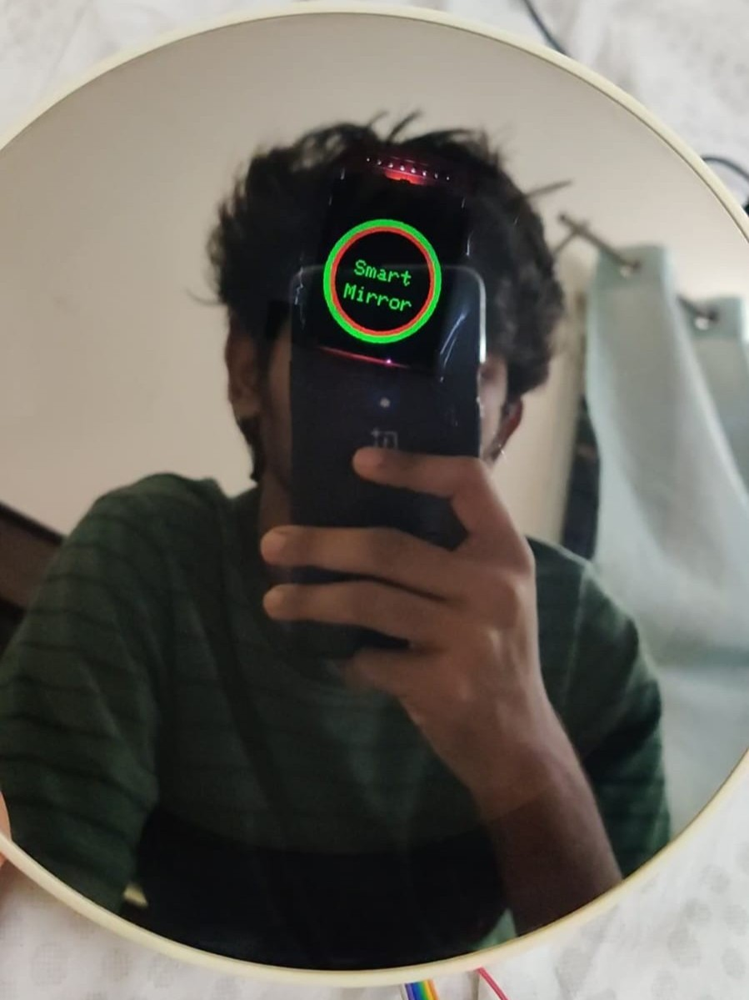
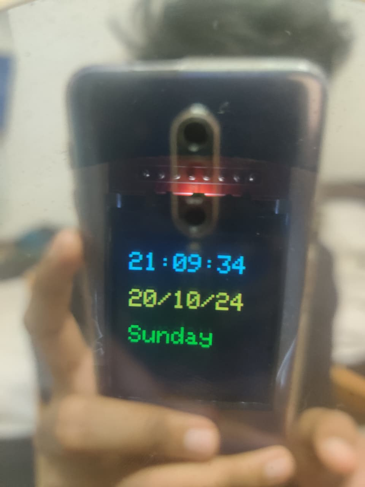
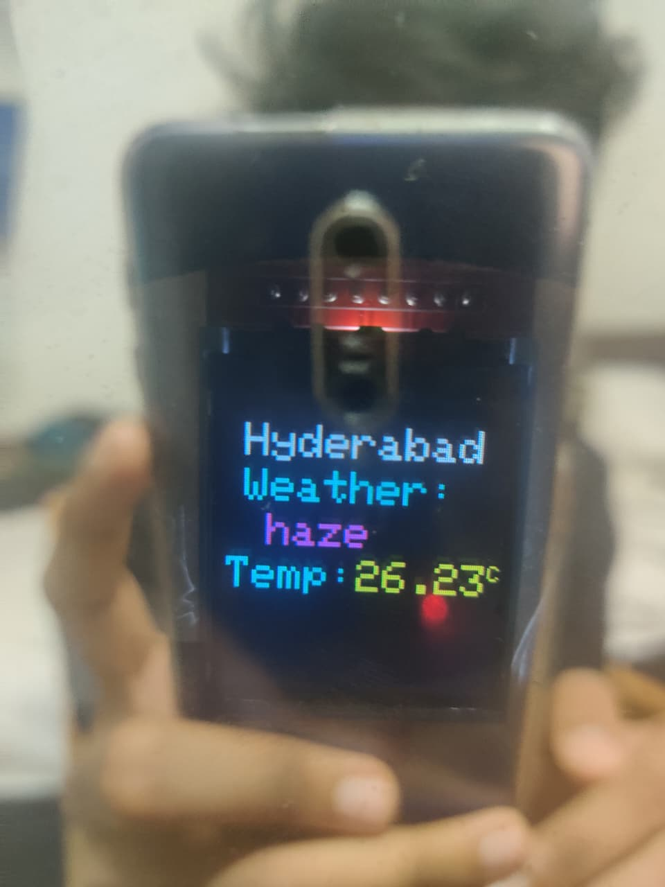
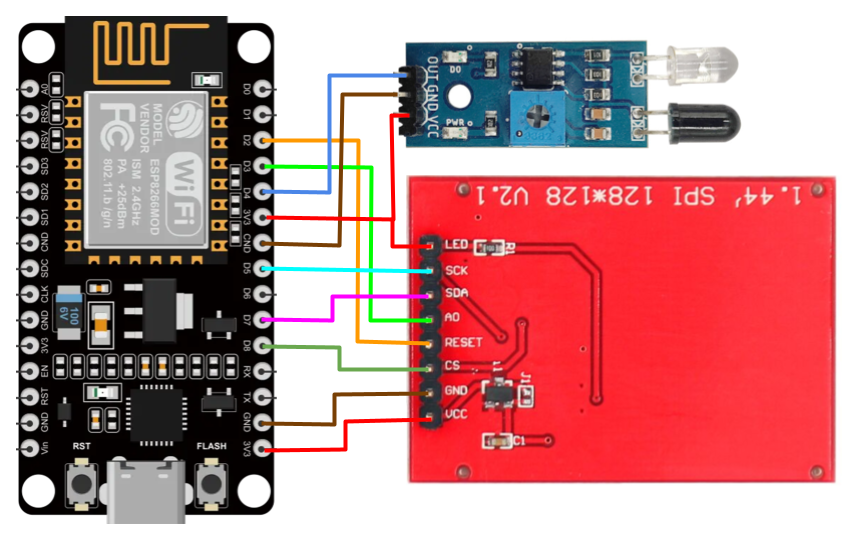

# Smart Mirror OS by NO !DEA

A futuristic smart mirror built using NodeMCU ESP8266, ST7735 TFT display, IR sensor, WiFi, weather API, and internet time synchronization.

---

## Created By

mad4machines

---

## Features

- Futuristic Smart Mirror Animation
- Motion Detection using IR Sensor
- Random Compliments
- Real-Time Clock & Date
- Live Weather Updates
- WiFi Connectivity
- OpenWeatherMap API Integration
---
<p align="center">
  
  
  
</p>

## YouTube Short

Watch the Smart Mirror Demo:
[▶ Watch on YouTube](https://youtube.com/shorts/pNvSnwVnmCU)

---

## Things Used

## 🪞 [Buy a Magic Mirror Photo Frame](https://amzn.to/42xLxRM)

| Component | Quantity |
|---|---|
| NodeMCU ESP8266 | 1 |
| ST7735 1.44" TFT Display | 1 |
| IR Sensor | 1 |
| Jumper Wires | Many |
| Breadboard | 1 |

---

## Circuit

---

## TFT Display Connections

| TFT Pin | NodeMCU Pin |
|---|---|
| VCC | 3.3V |
| GND | GND |
| SCL | D5 |
| SDA | D7 |
| RES | D2 |
| DC/A0 | D3 |
| CS | D8 |


## IR Sensor Connections

| IR Sensor | NodeMCU |
|---|---|
| VCC | 3.3V |
| GND | GND |
| OUT | D4 |

---

## Libraries Used

Install these libraries from Arduino IDE Library Manager:

- Adafruit GFX
- Adafruit ST7735
- ArduinoJson
- ESP8266WiFi

---

## Setup

### 1. Add WiFi Credentials

```cpp
const char* ssid = "YOUR_WIFI_NAME";
const char* password = "YOUR_WIFI_PASSWORD";
```

---

### 2. Add OpenWeatherMap API Key

Get API key from:

https://openweathermap.org/api

Replace:

```cpp
appid=YOUR_API_KEY
```

---


## How It Works

1. Smart mirror animation runs continuously.
2. IR sensor detects a person.
3. Mirror shows a random compliment.
4. If detected again:
   - Shows time & date.
5. If detected again:
   - Shows live weather.
---

## Future Improvements

- Voice Assistant
- Face Recognition
- Spotify Integration
- News Headlines
- Home Automation
- AI Chat Assistant

---

## License

Open-source project.

---

## Author

mad4machines
